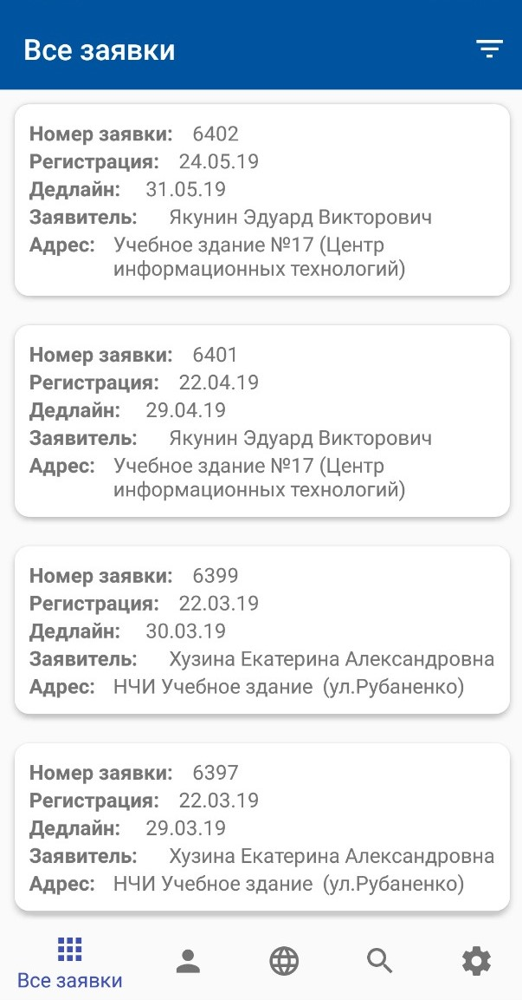
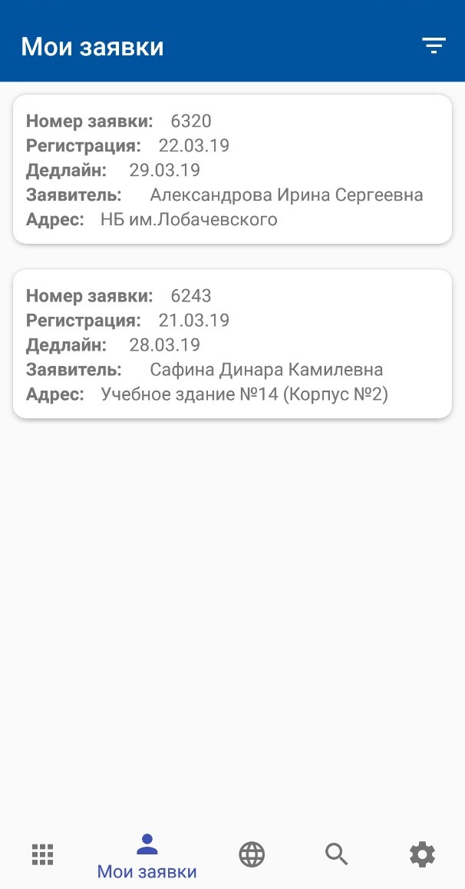
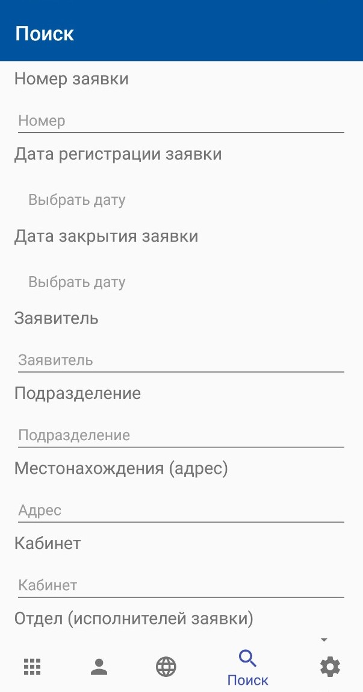
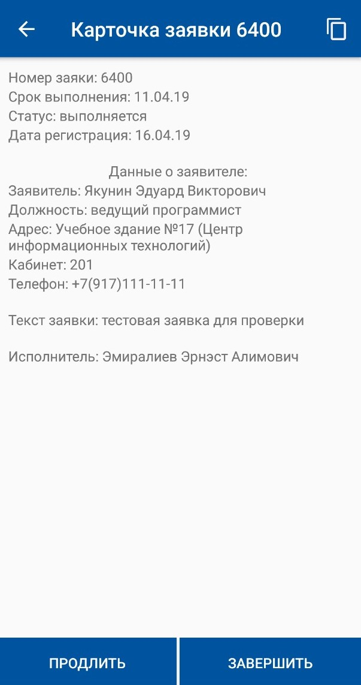

<h1><strong>ServiceDesk Mobile</strong></h1>
<h2>About ServiceDesk:</h2>
In Kazan we got a lot of KFU buildings, where we got many teachers and professors sitting in there. If something is broken or teacher doesn't know how to fix some problem (For example, laptop is shut down, printer does not work and stuff), we have a team of employeers, whoes gonna help them in any moment. So if teacher wants to fix his computer, he makes a request to the ServiceDesk. Then employeer who wants to help will take this request and help teacher out. In the application we got the Map that shows where is a problem happened, so employeer can easily understand where to go and take that one. ServiceDesk is available in the DESKTOP, however we're intergrating it to the MOBILE version
<h2>Contents:</h2>
<ul>
  <li>
    <h4>All requests</h4>
    On that screen user can explore all requests in the ServiceDesk. He can sort them by a few parameters. If you wanna see more details about current request, you can click on the cardview and you're gonna jump into the Detail Page of Picked Request  
    
  </li>
    <li>
    <h4>My requests</h4>
    On that screen user can explore only his own requests in the ServiceDesk. He can sort them by a few parameters. If you wanna see more details about current request, you can click on the cardview and you're gonna jump into the Detail Page of Picked Request  
    
  </li>
  <li>
    <h4>Search</h4>
    On that screen user can search requests by many parameters. This is a global search. He can use status, date, cod and so on  
    
  </li>
  <li>
    <h4>Request Detail Page</h4>
    Here is the detail information about the request. User can make a call or copy whole data. At the bottom two buttons for next actions with this request  
    
  </li>
</ul>
